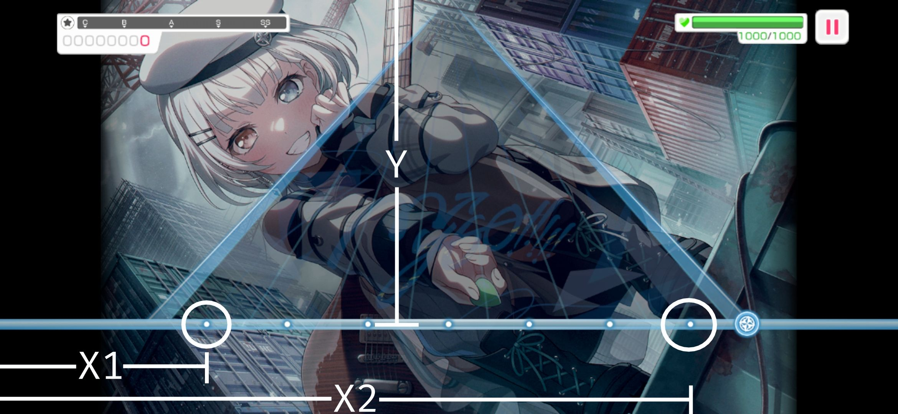

# (WIP) ssm - Star Stone Miner
(开发中) *BanG Dream! 少女乐团派对！* 星石挖掘机

## 简介
- **自用项目**
- 仅适用于支持 **Android开放配件(AOA) 2.0** 协议的Android设备
	 - 2011年以后出厂的Android设备基本都支持AOA 2.0

### 优势
- 内置资源解包模块，可以提取游戏中的图像资源和乐谱数据
- （一定程度上）规避检测
	- 非侵入式设计，不会干预游戏进程
	- 无需root权限
	- （选择后端为`hid`时）无需启用USB调试
	- 无需修改游戏安装包或游戏数据
	- 触点可以通过“显示点按操作反馈”显示
- 采用图着色算法分配指针ID，使用尽可能少的触点完成演奏
	- 理论上95%以上的谱面可仅使用两根手指完成
- 使用golang编写
	- *“可以和我GO!!!!!一辈子吗”*

### 缺陷
- **目前只有命令行界面**
- 必须使用USB数据线连接游戏设备
    - 如果使用`adb`作为后端时，可以使用无线连接（即所谓的无线调试）。但在实际的测试中，这种方式对本地局域网的要求较高，对于性能较差的网络设备，自动打歌的准度将下降
- 必须手动触发打歌

## 使用
使用步骤与phisap类似，如果你用过的话

### 准备工作
1. 准备一台计算机，用于运行本程序以及连接游戏设备
	- 对硬件配置没有硬性要求，台式机、笔记本甚至树莓派均可
    - 支持Windows、Linux、MacOS。以下是目前自动构建所支持的系统及架构（请注意区分 **amd64** 和 **arm64** ）。如果你的系统或架构不在这个列表内，可以尝试[自行构建ssm](#构建)。
        - Linux amd64 (x86_64)
        - Linux arm64 (aarch64)
        - MacOS (darwin) x86_64
        - MacOS aarch64
        - Windows x86_64
2. 安装依赖
    - 安装FFmpeg和Libusb
        - Windows：从release页下载的压缩包中已经带了所需的dll，**解压整个压缩包后**，在解压目录内直接运行即可
        - Mac OS：请使用`brew`或类似工具安装，例如`brew install ffmpeg libusb`
        - Linux：不同的发行版命令不同，因此请自行搜索。总之需要`libusb-1.0.so`、`libavcodec.so`、`libavformat.so`和`libavutil.so`
    - 如果打算选择`adb`作为工作后端，需要安装并配置好`adb`（确保在命令行中执行`adb version`不会报错）
3. 测量游戏设备的屏幕分辨率
	- 这里约定屏幕的短边为宽，长边为高
	- 一些手机可以直接在设置中看到屏幕参数，或者也可以截一张图，测量截图的尺寸
4. 进入游戏，随便选一首歌 ，进入打歌界面，测量：
	- 判定线到屏幕顶端的距离（单位：像素），记为`Y`
	- 判定线上最左侧的点（下图中左侧圈中的点）到屏幕最左端的距离（单位：像素），记为`X1`
	- 判定线上最右侧的点（下图中右侧圈中的点）到屏幕最左端的距离（单位：像素），记为`X2`
	- 如下图所示，允许±20个像素的误差，结果保留到整数 
5. 从游戏设备中导入所需素材（乐谱数据）
    - 将游戏设备中的`/sdcard/Android/data/{游戏包名}/files/data/`整个文件夹导入到计算机中，存储的位置随意
      - 例如日服的包名是`jp.co.craftegg.band`
      - 可以开启USB调试功能然后使用adb命令导入，比如`adb pull /sdcard/Android/data/jp.co.craftegg.band/files/data/`
      - 每次游戏更新（加入新歌或新的难度等级）后都需要重新导入数据
6. 解包素材
    - 为`ssm`可执行文件（Windows平台为`ssm.exe`）传入`-e`和`{导入的数据文件夹}`参数，即可自动开始解包过程，解包后ssm将在可执行文件所在的文件夹内生成`assets`文件夹，为解包结果

### 开始打歌
在准备工作完成后，即可开始打歌

1. 在bestdori或类似网站上查阅需要打的歌的歌曲ID，歌曲ID是一个整数，例如《EXIST》的歌曲ID是`325`
2. 将游戏设备连接到计算机
3. 启动游戏，此时游戏设备会进入横屏模式
4. 使用命令`./ssm -d {难度} -n {歌曲ID} -r {旋转方向}`启动ssm
    - 需要先将命令行的工作目录切换到ssm所在的文件夹（使用`cd`命令，对于Windows系统也可以`Shift+鼠标右键`选择`在此处打开powershell`）
    - 请一定要使用命令行启动。**直接双击（如在Windows系统中）或单击（在某些Linux的DE中）启动ssm是无效的**
    - 选择工作后端，目前支持`hid`和`adb`。使用`-b`选项指定。如果没有指明，则默认选择`hid`作为后端
        - 目前`adb`后端暂时没有特殊功能，因此，如果`hid`能工作，还是推荐选择`hid`
        - 使用`adb`作为后端时**需要游戏设备启用USB调试**
	- 如果是第一次使用ssm，ssm会询问游戏设备的相关信息，例如屏幕尺寸、判定线的`X1`, `X2`和`Y`，需将准备工作中测量得到的数据输入程序，ssm会保存这些数据（保存到ssm所在文件夹内的`config.json`文件中）
	- `{难度}`为要打的曲目难度，可选的值有`easy`（简单）、`normal`（普通）、`hard`（困难）、`expert`（专家）和`special`（特殊）
	- 示例：如果要打《EXIST》的专家难度，则对应的命令为`ssm -d expert -n 325`
	- `{旋转方向}`为设备的旋转方向，可选值为`left`和`right`。横屏时屏幕的顶边（前置摄像头最靠近的那条边）在左侧则为向左旋转（逆时针旋转），在右边则为向右旋转（顺时针旋转）。若旋转方向为左，`-r`选项可以省略
	- 如果一切正常，控制台（或命令提示符）会输出`Ready. Press ENTER to start autoplay.`
5. 在游戏设备中选中对应的曲目和难度，进入打歌界面
6. 当第一个音符快到判定线时，在运行了ssm的控制台内敲下回车
7. 若一切正常，ssm会自动完成曲目剩余的部分。若希望中断自动打歌，可以直接在控制台（或命令提示符）中输入`Ctrl-C`（Windows下是`Ctrl-Z`）强制终止程序

## 常见问题
### Windows下的运行问题
如果你在Windows下运行ssm，连接了游戏设备后ssm没有列出你的设备，那么可能是驱动的问题。请尝试卸载设备对应的驱动，并重新安装 [Google提供的驱动](https://dl.google.com/android/repository/usb_driver_r13-windows.zip)
具体请参考Genymobile/scrcpy项目的 [这个issue](https://github.com/Genymobile/scrcpy/issues/3654) 的 [这个回复](https://github.com/Genymobile/scrcpy/issues/3654#issuecomment-1369278232) 和它后边的回复

或者，你也可以尝试一下`adb`后端，看看能否工作

### 断触问题
有时可能会出现歌打一半所有音符都miss，但ssm仍在正常发送触控事件的问题。此问题在日服下较常出现，在国际服下几乎很少遇到。目前没有找到导致这一问题的原因。推测可能是触发了某种反作弊机制（可能性较低），也可能仅仅是游戏客户端的bug（因为这一问题出现前经常会出现一个短时间的游戏卡顿，可能是垃圾回收器发力了）。尚不清楚该现象会对游戏帐号有何影响。该问题对multi live影响较大（对于单机live，只要重新开始live一般都能解决），目前作者在尝试给出一个解决方案

## 构建
如果你有能力，也可以自行构建ssm。大致步骤如下：
1. 安装golang。请安装1.24及以上的版本
2. 安装gcc
    - 本项目依赖CGO，因此这一步是必需的
    - 版本号没有严格要求，但不要安装太旧的版本，9.x以上应该问题不大（开发和构建时的gcc版本为15.1.1）
    - 安装完后，请测试一下能不能用（`gcc -v`不报错）
    - 对于Windows平台，推荐使用MSYS2环境，然后安装MinGW套件
3. 安装pkgconf
4. 安装依赖库：libusb（1.0，注意**不是0.1！**）、ffmpeg、libavcodec、libavformat和libavutil
    - 在一些系统上，当你安装完ffmpeg后，会自动安装后三个；而另一些系统上，后四个项会被打包进一个包内
    - 某些系统上，你可能还需要安装带有`-dev`或`-devel`后缀的包（会包含一些编译用的头文件）
5. `git clone https://github.com/kvarenzn/ssm.git`
    - 或者你也可以下载源码包
6. `cd ssm`
7. `go build`
    - 在构建ssm时，需要手动传入版本号，否则版本号为`(unknown)`。当然，这不影响使用
    - 使用`go build -ldflags "-X main.SSM_VERSION=$VERSION"`传入版本号

如果有问题，可以参考本项目下的`.github/workflows/release.yml`

## TODO
- [ ] 图形化控制界面
- [X] 把用scrcpy-server进行控制的功能抄过来
	- [ ] 读取游戏设备屏幕内容
		- [ ] 识别选中歌曲及难度
		- [ ] 自动开始
		- [ ] 自动重复

## 参考及引用
- 解包部分参考 [Perfare/AssetStudio](https://github.com/Perfare/AssetStudio.git) 和 [nesrak1/AssetsTools.NET](https://github.com/nesrak1/AssetsTools.NET.git)，在此致谢
- Texture2D解码部分参考 [Perfare/AssetStudio](https://github.com/Perfare/AssetStudio.git) 和 [AssetRipper/AssetRipper](https://github.com/AssetRipper/AssetRipper.git) ，在此致谢
- 代码及实现思路继承自我的另一个（已停止更新的）项目 [phisap](https://github.com/kvarenzn/phisap) ，使用go重写
- 当选择`adb`作为后端时，`ssm`依赖[Genymobile/scrcpy](https://github.com/Genymobile/scrcpy) 的服务端`scrcpy-server`。该项目依Apache 2.0协议开源，在此感谢项目作者&维护者们的工作

## 开源协议
GPLv3
