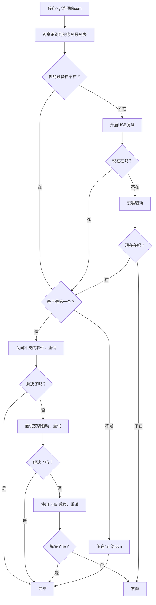

# 常见问题

## Windows下`hid`后端无法识别设备

可能是驱动问题。可尝试卸载设备驱动并安装 [Google提供的驱动](https://dl.google.com/android/repository/usb_driver_r13-windows.zip)
详细请参考 Genymobile/scrcpy 项目的 [相关issue](https://github.com/Genymobile/scrcpy/issues/3654)

或直接尝试`adb`后端

## 使用`hid`后端报错`libusb: not found [code -5]`

很多情况都可能导致这个问题。需要按顺序排错。

1. 将`-g`选项传给ssm并重新运行。这时ssm会输出一些以`DEBUG`开始的行，注意其中的`Recognized devices:`，表示ssm识别到的设备。这是一个列表，列表中每一项都是一个设备的序列号(device serial)
2. 看看你的设备的序列号在不在其中。如果你不知道设备序列号，你可以按照下边的步骤查询：
   1. 确保`adb`已经正确安装，并且`adb version`可以正确运行，不报错
   2. 在你的游戏设备上开启USB调试，连接到计算机上
   3. 运行`adb devices`，这一命令会输出类似下边的内容
      ```
      List of devices attached
      XXXXXXXX	device
      ```
      前边的`XXXXXXXX`就是你的设备序列号
   4. 关闭游戏设备的USB调试选项，在计算机上运行`adb kill-server`
3. 根据实际情况分类：
   - 如果在
     - 看看你的设备序列号是不是列表中的第一个
       - 如果不是
         - 你只需要用`-s {设备序列号}`选项告诉ssm连接到你的设备即可解决问题
       - 如果是
         1. 请关闭计算机上任何正在与你设备通信的软件，比如各种手机管家、USB抓包软件和adb，然后重试
         2. 如果还是无法解决，你可以试试上一个问题的解决方案（安装驱动），再重试
         3. 如果还是不行，开启设备的USB调试，然后使用`adb`后端，重试
         4. 如果`adb`后端也无法工作，放弃
   - 如果不在
     1. 开启设备的USB调试后，重试最外层的第1、2步。如果这时候设备序列号在列表中，那么保持设备的USB调试开启，尝试最外层的第3步
     2. 如果还是没有，尝试上一个问题的解决方案，重试
     3. 如果还是不行，放弃



## 断触问题

有时会出现 **所有音符都miss** 但ssm仍然在发送触控事件的情况

- 日服较常见，国际服极少出现
- 或许是反作弊机制（可能性较低）或客户端bug
- 对于自由演出模式，重开一般可解决
- 对于协力演出模式，暂时无法解决，请谨慎使用
